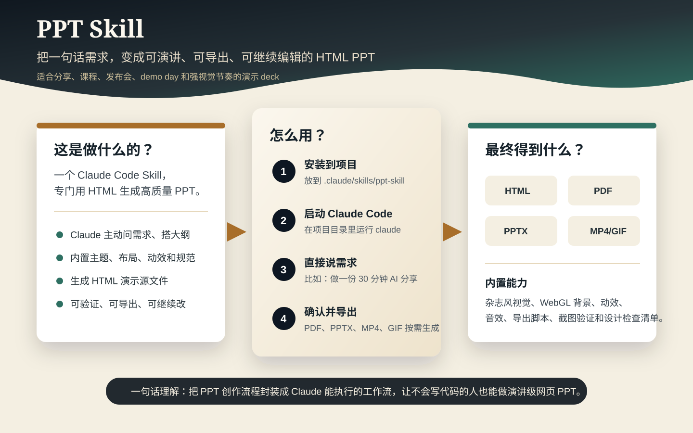

# PPT Skill

用 Claude Code 做演讲级 PPT 的 Skill。装好之后，直接跟 Claude 聊天就能生成 PPT——不需要你会写代码。



## 怎么用

### 第 1 步：装进你的项目（1 分钟）

打开终端，`cd` 到你**要做 PPT 的那个项目目录**，然后执行：

```bash
mkdir -p .claude/skills
git clone https://github.com/Wcof/ppt-skill.git .claude/skills/ppt-skill
```

> 不会用 git？也可以直接去 GitHub 页面点「Code → Download ZIP」，下载后解压到 `.claude/skills/ppt-skill` 目录下。

装完后你的项目目录长这样：

```
你的项目/
├── .claude/
│   └── skills/
│       └── ppt-skill/        ← 就是本仓库
│           ├── SKILL.md
│           └── ...
└── ...（你项目原来的文件）
```

**为什么要放这个位置？** 因为 Claude Code 会自动读取项目下 `.claude/skills/` 里的文件。放好之后不需要任何配置，Claude 自己就能识别这个 skill。

### 第 2 步：跟 Claude 说你要做什么 PPT

在同一个项目目录下启动 Claude Code：

```bash
claude
```

然后直接用大白话告诉它，比如：

```
帮我做一份关于 AI Agent 的分享 PPT，30 分钟，面向技术团队
```

**Claude 会主动问你问题、帮你搭大纲、生成页面——你只需要回答和确认。** 对话大概长这样：

```
你：帮我做一份关于 AI Agent 的分享 PPT，30 分钟，面向技术团队

Claude：好的，先确认几个关键信息：
1. 分享场景是？（内部技术分享 / 大会演讲 / demo day）
2. 有没有现成的素材？（文档、文章、旧 PPT）
3. 想要哪套视觉风格？我有 5 套预设主题可选

你：内部技术分享，我有一篇 Notion 文档，风格选靛蓝瓷

Claude：收到，我先读你的文档，搭大纲给你确认，确认后开始生成页面。
```

它会一步步带你走完全流程：

```
问你需求 → 搭大纲给你确认 → 选视觉风格 → 生成页面 → 质量检查 → 导出文件
```

**全程你不需要写任何代码，只需要回答问题和点确认。**

### 第 3 步：导出

PPT 做完后，告诉 Claude 你要导出什么格式就行，比如：

- `导出成 PDF`
- `导出成可以编辑的 PPTX`
- `导出演示视频`
- `给视频加上背景音乐`

Claude 会帮你跑命令、处理依赖。你也可以事后自己在终端跑导出命令，详见 `scripts/` 目录下各脚本的注释。

> 部分导出功能（PDF、PPTX、视频）需要额外装一些工具。不用导出的话完全不用管——生成功能本身零依赖。

## 它能做什么

| 能力 | 说明 |
|------|------|
| **杂志风视觉** | WebGL 动态背景、5 种入场动效、10 种页面布局、5 套预设主题 |
| **多种导出格式** | PDF、可编辑 PPTX（双击就能在 PowerPoint/WPS 里改）、MP4、GIF |
| **演示音效** | 3 首背景音乐 + 34 个音效，支持自动混合到视频里 |
| **自动质量检查** | 多视口截图验证、渲染错误检测、反 AI 廉价感设计清单 |
| **灵活架构** | 10 页以内用单文件横向翻页，10 页以上用多文件拼接 |

## 进阶：目录结构

```text
ppt-skill/
├── SKILL.md                              # 核心 skill 定义（Claude 读的就是这个文件）
├── assets/
│   ├── templates/                         # HTML 模板（单文件 / 多文件 / web component）
│   ├── motion.min.js                      # 动效库（离线兜底）
│   ├── examples/                          # 示例项目
│   └── audio/                             # BGM + 音效素材
├── references/                            # 设计规范文档（布局、组件、主题、检查清单等）
└── scripts/                               # 导出 + 验证脚本
```

## 来源与许可

本项目是融合派生项目：

- 单文件杂志风模板、动效系统、布局、主题和检查清单来自 `guizang-ppt-skill`（MIT License）
- 多文件 deck 架构、导出脚本、验证脚本、音频资产和设计方法论来自 `huashu-design`（Personal Use License）

个人学习和创作可用；涉及企业、团队、商业交付或付费服务时，需要遵守上游 `huashu-design` 的授权要求。详见 `LICENSE`。
