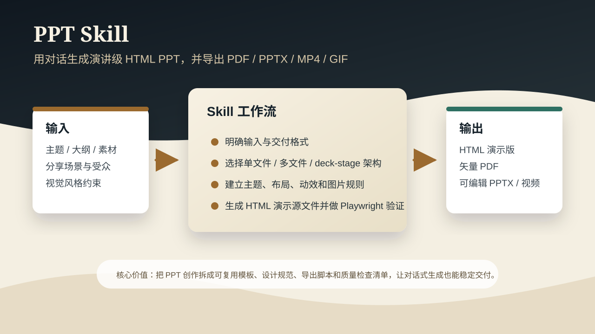

# PPT Skill

用 Claude Code 做演讲级 PPT 的 Skill。安装后直接对话，Claude 会引导你完成选题、大纲、视觉系统、生成、验证、导出全流程。



## 怎么用（3 步搞定）

### 第 1 步：把这个 skill 装进你的项目

假设你要做一个 PPT，你的项目目录是 `~/my-project/`。

**只需要把本仓库克隆（或下载）到你项目的 `.claude/skills/` 目录下：**

```bash
# 进入你的项目目录
cd ~/my-project/

# 创建 skills 目录（如果还没有的话）
mkdir -p .claude/skills

# 克隆本仓库到 skills 目录下
git clone https://github.com/Wcof/ppt-skill.git .claude/skills/ppt-skill
```

装完后你的项目目录长这样：

```
my-project/
├── .claude/
│   └── skills/
│       └── ppt-skill/        ← 就是本仓库
│           ├── SKILL.md
│           └── ...
└── ...（你项目的其他文件）
```

> **为什么要放这里？** Claude Code 会自动读取项目下 `.claude/skills/` 里的 skill 文件。放好之后不需要额外配置，Claude 自己就能识别。

> **多个项目都想用？** 可以用符号链接避免重复克隆：
> ```bash
> # 克隆一次
> git clone https://github.com/Wcof/ppt-skill.git ~/ppt-skill
> # 然后在每个项目里链接
> mkdir -p ~/my-project/.claude/skills
> ln -s ~/ppt-skill ~/my-project/.claude/skills/ppt-skill
> ```

### 第 2 步：打开 Claude Code，直接说你要做什么

打开终端，`cd` 到你的项目目录，启动 Claude Code：

```bash
cd ~/my-project/
claude
```

然后直接用自然语言告诉它你要做什么 PPT，比如：

```
帮我做一份关于 AI Agent 的分享 PPT，30 分钟，面向技术团队
```

**Claude 会主动引导你，不需要你记任何命令。** 对话大概长这样：

```
你：帮我做一份关于 AI Agent 的分享 PPT，30 分钟，面向技术团队

Claude：好的，先确认几个关键信息：
1. 分享场景是？（内部技术分享 / 大会演讲 / demo day）
2. 有没有现成的素材？（文档、文章、旧 PPT）
3. 想要哪套视觉风格？我有 5 套预设主题可选
...

你：内部技术分享，我有一篇 Notion 文档，风格选靛蓝瓷

Claude：收到，我先读你的文档，搭大纲给你确认。
```

它会按这个流程一步步带你走完：

```
问你需求 → 搭大纲（给你确认）→ 选视觉风格 → 生成页面 → 质量检查 → 导出文件
```

**全程你只需要回答问题和点确认，不需要写任何代码。**

### 第 3 步：导出为你要的格式

PPT 生成完后，Claude 会问你要导出什么格式。你也可以自己跑命令：

```bash
# 验证（检查有没有渲染错误）
python3 scripts/verify.py my-deck/index.html --viewports 1920x1080,375x667

# 导出 PDF
node scripts/export_deck_pdf.mjs --slides my-deck/slides --out my-deck/deck.pdf

# 导出可编辑 PPTX（双击就能在 PowerPoint / WPS 里编辑）
node scripts/export_deck_pptx.mjs --slides my-deck/slides --out my-deck/deck.pptx

# 导出演示视频 MP4
NODE_PATH=$(npm root -g) node scripts/render-video.js my-deck/index.html --duration=30

# 视频转 60fps 或 GIF
bash scripts/convert-formats.sh my-deck/index.mp4 960

# 给视频加背景音乐
bash scripts/add-music.sh my-deck/index.mp4 --mood=tech
```

> 导出功能需要额外装一些工具（不装也能用，只是导出功能用不了）：
> - PDF / PPTX / 验证：`pip install playwright && playwright install chromium` + `npm install playwright pdf-lib pptxgenjs sharp`
> - 视频录制：`npm install -g playwright && playwright install chromium`，还需要系统装 ffmpeg

## 特性

### 视觉体系

- **WebGL 双背景**：全息色散（深色）+ 旋转涡流（浅色），hero 页自动透出
- **Motion One 动效**：5 种入场 recipe（cascade / hero / quote / directional / pipeline），离线可用
- **5 套预设主题**：墨水经典、靛蓝瓷、森林墨、牛皮纸、沙丘——不允许自定义 hex，保护美学
- **杂志感组件**：字体体系、数据卡片、引用框、平台卡、流水线、图片框、Lucide 图标
- **10 种页面布局**：封面、幕封、数据大字报、左文右图、图片网格、流水线、悬念页、大引用、对比页、图文混排

### 工程能力

- **三种架构**：单文件横向翻页（≤10 页）、多文件 iframe 拼接（10+ 页）、deck-stage web component
- **全格式导出**：PDF（矢量文字）、可编辑 PPTX（双击编辑）、MP4（25/60fps）、GIF（palette 优化）
- **演示音频**：3 首场景化 BGM + 34 个 SFX 预制素材，支持自动混合
- **Playwright 验证**：多视口截图、console 错误检测

### 设计方法论

- **反 AI Slop 清单**：系统性规避紫色渐变、emoji 图标、圆角卡片等 AI 廉价感
- **品牌资产协议**：涉及具体品牌时的快速资产收集流程
- **设计方向顾问**：需求模糊时从 5 大风格流派推荐 3 个差异化方向
- **视觉主角多样性**：10 种视觉元素类型轮换，避免每页都长一样
- **质量检查清单**：P0-P3 分级 + 类名强制预检 + 动效自检

## 目录结构

```text
ppt-skill/
├── SKILL.md                              # 核心 skill 定义（工作流 + 原则 + 清单）
├── README.md
├── README.en.md                          # English README
├── LICENSE
├── assets/
│   ├── templates/
│   │   ├── single-file-magazine.html     # 杂志风单文件模板（CSS + WebGL + JS + 动效）
│   │   ├── deck_index.html               # 多文件 deck 拼接器
│   │   └── deck_stage.js                 # <deck-stage> web component
│   ├── motion.min.js                     # Motion One 动效库（离线兜底，64KB）
│   ├── examples/                          # 示例项目
│   └── audio/
│       ├── bgm/                          # 3 首场景化 BGM（tech / tutorial / educational）
│       └── sfx/                          # 34 个音效（8 类：keyboard / ui / transition / container / feedback / progress / impact / terminal）
├── references/
│   ├── architecture.md                   # 单文件 vs 多文件 vs deck-stage 架构选择
│   ├── layouts.md                        # 10 种页面布局骨架（含动效标记）
│   ├── components.md                     # 组件手册（字体、色、网格、图标、callout、stat、pipeline、动效）
│   ├── slide-design.md                   # 设计规范（密度、节奏、视觉主角、Speaker Notes）
│   ├── themes.md                         # 5 套主题色预设
│   ├── image-prompts.md                  # GPT-M 2.0 配图类型、比例和基础提示词
│   ├── checklist.md                      # 质量检查清单（P0-0 预检 + P0-P3 + 动效自检）
│   ├── audio.md                          # SFX / BGM 规则和合成模板
│   ├── editable-pptx.md                  # 可编辑 PPTX 的 HTML 硬约束
│   └── workflow.md                       # 快速工作流参考
└── scripts/
    ├── verify.py                         # Playwright 验证
    ├── html2pptx.js                      # HTML DOM → PowerPoint 转换器
    ├── render-video.js                   # HTML 动画 → MP4
    ├── export_deck_pdf.mjs               # 多文件 → PDF
    ├── export_deck_pptx.mjs              # 多文件 → 可编辑 PPTX
    ├── export_deck_stage_pdf.mjs         # 单文件 deck-stage → PDF
    ├── convert-formats.sh                # MP4 → 60fps MP4 + GIF
    └── add-music.sh                      # 混合 BGM 到视频
```

## 来源与许可

本项目是融合派生项目：

- 单文件杂志风模板、动效系统、布局、主题和检查清单来自 `guizang-ppt-skill`（MIT License）
- 多文件 deck 架构、导出脚本、验证脚本、音频资产和设计方法论来自 `huashu-design`（Personal Use License）

个人学习和创作可用；涉及企业、团队、商业交付或付费服务时，需要遵守上游 `huashu-design` 的授权要求。详见 `LICENSE`。
